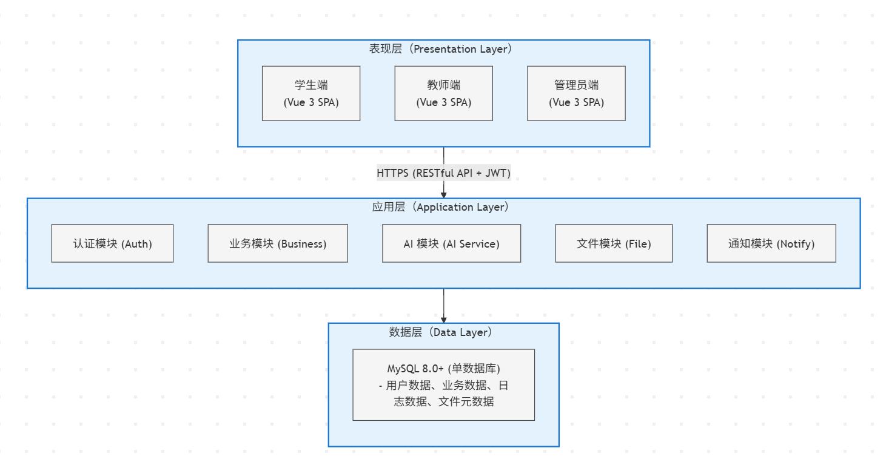
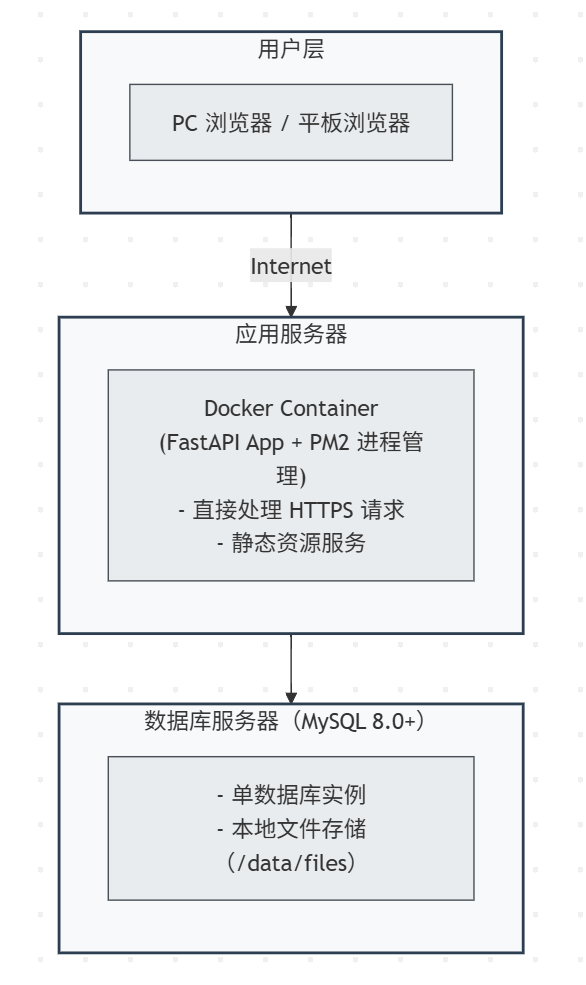
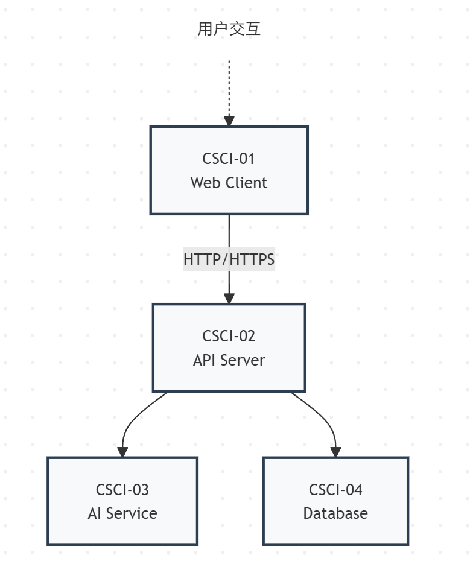

# AI 学伴 - 系统设计文档（SDD）

## 文档信息

| 项目名称 | AI 学伴 - 轻量化团队 AI 辅助学习平台 |
|---------|-------------------------------------|
| 文档版本 | v2.0 |
| 创建日期 | 2026-04-08 |
| 最后更新 | 2026-04-15 |
| 文档状态 | 重构版 |
| 维护者 | 陈城 |
| 关联文档 | 需求说明书（SRS）v1.1、规范驱动开发文档（spec.md）v1.0 |

---

## 修订历史

| 版本 | 日期 | 修订人 | 修订内容 | 审核状态 |
|------|------|--------|----------|----------|
| v1.0 | 2026-04-08 | 陈城 | 初始版本 | 已审核 |
| v2.0 | 2026-04-15 | 陈城 | 重构架构设计，修正 CSCI/CSC 划分 | 待审核 |

---

## 目录

1. [概述](#1-概述)
2. [架构设计](#2-架构设计)
3. [CSCI 详细设计](#3-csci-详细设计)
4. [接口设计](#4-接口设计)
5. [性能指标设计](#5-性能指标设计)
6. [硬件设计](#6-硬件设计)
7. [其他设计](#7-其他设计)

---

## 1. 概述

### 1.1 文档目的

本文档是"AI 学伴 - 轻量化团队 AI 辅助学习平台"的系统设计文档（System Design Document, SDD），旨在将需求规格说明书（SRS）中定义的功能需求转化为具体的系统设计方案，为开发人员提供详细的实现指导。

### 1.2 文档范围

本文档涵盖：
- 系统总体架构设计
- 软件配置项（CSCI）划分与设计
- 硬件配置项（HWCI）设计
- 接口设计（内部接口、外部接口、用户界面）
- 性能指标设计
- 可靠性、可维护性等质量属性设计

### 1.3 术语与缩写

| 术语/缩写 | 说明 |
|-----------|------|
| SDD | 系统设计文档（System Design Document） |
| SRS | 需求规格说明书（Software Requirements Specification） |
| CSCI | 计算机软件配置项（Computer Software Configuration Item） |
| CSC | 计算机软件组件（Computer Software Component） |
| HWCI | 计算机硬件配置项（Computer Hardware Configuration Item） |
| API | 应用程序接口（Application Programming Interface） |
| JWT | JSON Web Token |
| RBAC | 基于角色的访问控制（Role-Based Access Control） |
| RESTful | 表述性状态转移（Representational State Transfer） |
| AI | 人工智能（Artificial Intelligence） |
| OCR | 光学字符识别（Optical Character Recognition） |

### 1.4 参考资料

- 《AI 学伴 - 需求说明书》v1.1
- 《AI 学伴 - 规范驱动开发文档》v1.0
- 《AI 学伴 - 项目计划书》v1.0
- GB/T 8567-2006 计算机软件文档编制规范
- GJB 438C-2021 军用软件开发文档通用要求

---

## 2. 架构设计

### 2.1 系统总体架构

#### 2.1.1 架构概述

本系统采用前后端分离的分层架构，整体划分为三层：



#### 2.1.2 架构特点

| 特点 | 说明 |
|------|------|
| **前后端分离** | 前端负责展示和交互，后端负责业务逻辑和数据处理 |
| **轻量化架构** | 单 MySQL 数据库，无缓存层，降低运维复杂度 |
| **RESTful API** | 统一使用 REST 风格接口进行通信 |
| **JWT 认证** | 无状态认证，支持水平扩展 |
| **多 AI 服务商** | 支持多个 AI 服务商，具备降级能力 |
| **本地文件存储** | 文件直接存储在服务器本地 |

### 2.2 系统部署架构



### 2.3 软件配置项（CSCI）划分

#### 2.3.1 CSCI 列表

| CSCI 编号 | CSCI 名称 | 说明 | 开发语言 |
|-----------|-----------|------|----------|
| CSCI-01 | 前端应用（Web Client） | 学生端、教师端、管理员端 SPA 应用 | JavaScript (ES6+) + Vue 3 |
| CSCI-02 | 后端应用（API Server） | RESTful API 服务、业务逻辑处理 | Python 3.10+ |
| CSCI-03 | AI 服务模块（AI Service） | AI 接口封装、多服务商切换 | Python 3.10+ |
| CSCI-04 | 数据库（Database） | 数据存储、索引、视图 | MySQL 8.0+ |

#### 2.3.2 CSCI 关系图



### 2.4 硬件配置项（HWCI）划分

#### 2.4.1 HWCI 列表

| HWCI 编号 | HWCI 名称 | 规格 | 数量 | 用途 |
|-----------|-----------|------|------|------|
| HWCI-01 | 应用服务器 | 2 核 4G，50GB SSD | 1 台 | 部署 FastAPI 应用 |
| HWCI-02 | 数据库服务器 | 4 核 8G，100GB SSD | 1 台 | 部署 MySQL、文件存储 |

### 2.5 技术栈选型

#### 2.5.1 前端技术栈

| 技术 | 版本 | 用途 |
|------|------|------|
| Vue 3 | 3.3+ | 前端框架 |
| JavaScript | ES6+ | 开发语言 |
| Vite | 4.0+ | 构建工具 |
| Element Plus | 2.3+ | UI 组件库 |
| Axios | 1.4+ | HTTP 客户端 |
| Pinia | 2.1+ | 状态管理 |
| Vue Router | 4.2+ | 路由管理 |
| MathJax | 3.0+ | LaTeX 公式渲染 |

#### 2.5.2 后端技术栈

| 技术 | 版本 | 用途 |
|------|------|------|
| Python | 3.10+ | 开发语言 |
| FastAPI | 0.100+ | Web 框架 |
| Uvicorn | 0.23+ | ASGI 服务器 |
| SQLAlchemy | 2.0+ | ORM 框架 |
| Pydantic | 2.0+ | 数据验证 |
| JWT | 1.3+ | 身份认证 |
| Passlib | 0.17+ | 密码加密（BCrypt） |

#### 2.5.3 数据库与中间件

| 技术 | 版本 | 用途 |
|------|------|------|
| MySQL | 8.0+ | 关系型数据库（唯一数据源） |
| Docker | 24.0+ | 容器化 |

---

## 3. CSCI 详细设计

### 3.1 CSCI-01：前端应用（Web Client）

#### 3.1.1 CSCI-01 概述

| 项目 | 说明 |
|------|------|
| **名称** | 前端应用（Web Client） |
| **开发语言** | JavaScript (ES6+) + Vue 3 |
| **主要职责** | 提供学生端、教师端、管理员端用户界面 |
| **运行环境** | 浏览器（Chrome 90+、Firefox 88+、Edge 90+） |

#### 3.1.2 CSCI-01 的 CSC 划分

| CSC 编号 | CSC 名称 | 说明 |
|---------|---------|------|
| CSC-01-01 | 学生端前端 | 学生端所有功能的前端实现 |
| CSC-01-02 | 教师端前端 | 教师端所有功能的前端实现 |
| CSC-01-03 | 管理员端前端 | 管理员端所有功能的前端实现 |
| CSC-01-04 | 公共组件库 | 通用组件、工具函数、样式 |

#### 3.1.3 CSC-01-01：学生端前端

**功能说明**：
提供学生端所有功能的前端界面，包括登录注册、AI 答疑、笔记总结、错题分析、作业提交等功能。

**主要组件**：
- `LoginRegister.vue`：登录、注册、找回密码页面
- `StudentHome.vue`：学生端首页、功能导航
- `QuestionAnswer.vue`：问答输入、答案展示、多轮对话（支持 LaTeX 公式渲染）
- `NoteSummary.vue`：笔记上传、总结展示、导出功能
- `ErrorAnalysis.vue`：错题上传、分析结果、错题本管理
- `Homework.vue`：作业列表、提交、批改结果查看
- `PersonalCenter.vue`：个人信息、密码修改、登录日志

**API 调用**：
- `POST /api/v1/auth/login` - 登录
- `POST /api/v1/student/question` - AI 答疑
- `POST /api/v1/student/summary` - 笔记总结
- `POST /api/v1/student/error-analysis` - 错题分析
- `GET /api/v1/student/homework` - 作业列表
- `POST /api/v1/student/homework/submit` - 作业提交

#### 3.1.4 CSC-01-02：教师端前端

**功能说明**：
提供教师端所有功能的前端界面，包括 AI 出题、教案管理、试题管理、学生管理、作业批改等功能。

**主要组件**：
- `TeacherLogin.vue`：登录、注册页面
- `TeacherHome.vue`：教师端首页、数据概览
- `QuestionGenerate.vue`：出题参数配置、试题预览编辑
- `LessonPlan.vue`：教案列表、富文本编辑器、模板管理
- `QuestionBank.vue`：题库管理、组卷功能
- `StudentManage.vue`：学生列表、学习跟踪、一对一指导
- `HomeworkGrade.vue`：作业列表、批改界面、统计分析
- `TeacherCenter.vue`：个人信息、密码修改

**API 调用**：
- `POST /api/v1/teacher/question/generate` - AI 出题
- `GET /api/v1/teacher/lesson-plans` - 教案列表
- `POST /api/v1/teacher/lesson-plans` - 创建教案
- `GET /api/v1/teacher/questions` - 题库列表
- `GET /api/v1/teacher/students` - 学生列表
- `GET /api/v1/teacher/homework` - 作业列表
- `POST /api/v1/teacher/homework/grade` - 作业批改 |

#### 3.1.5 CSC-01-03：管理员端前端

**功能说明**：
提供管理员端所有功能的前端界面，包括用户管理、系统配置、数据统计、日志监控等功能。

**主要组件**：
- `AdminLogin.vue`：管理员登录
- `AdminHome.vue`：管理员端首页、数据概览
- `UserManage.vue`：用户列表、审核、角色分配
- `SystemConfig.vue`：AI 配置、系统参数、公告管理
- `DataStatistics.vue`：使用统计、AI 调用统计、教学效果分析
- `LogMonitor.vue`：操作日志、错误日志查看
- `AdminCenter.vue`：个人信息、密码修改

**API 调用**：
- `GET /api/v1/admin/users` - 用户列表
- `POST /api/v1/admin/users/audit` - 用户审核
- `GET /api/v1/admin/configs` - 系统配置
- `GET /api/v1/admin/statistics` - 数据统计
- `GET /api/v1/admin/logs` - 日志查询 |

#### 3.1.6 CSC-01-04：公共组件库

**功能说明**：
提供通用组件、工具函数、样式文件等，供学生端、教师端、管理员端共用。

**主要内容**：
- **基础组件**：按钮、表单、弹窗、表格、下拉框等 Element Plus 封装
- **布局组件**：导航栏、侧边栏、页脚、面包屑等
- **工具函数**：日期格式化、数据验证、API 请求封装、错误处理
- **样式文件**：全局样式、主题变量、响应式断点
- **路由配置**：路由定义、权限控制、路由守卫
- **状态管理**：Pinia store 定义（用户状态、系统配置等） |

### 3.2 CSCI-02：后端应用（API Server）

#### 3.2.1 CSCI-02 概述

| 项目 | 说明 |
|------|------|
| **名称** | 后端应用（API Server） |
| **开发语言** | Python 3.10+ |
| **主要职责** | 提供 RESTful API、业务逻辑处理、数据持久化 |
| **运行环境** | Docker 容器（FastAPI + Uvicorn + PM2） |

#### 3.2.2 CSCI-02 的 CSC 划分

| CSC 编号 | CSC 名称 | 说明 |
|---------|---------|------|
| CSC-02-01 | 认证模块 | 用户注册、登录、权限控制 |
| CSC-02-02 | 学生业务模块 | 学生端所有功能的后端实现 |
| CSC-02-03 | 教师业务模块 | 教师端所有功能的后端实现 |
| CSC-02-04 | 管理员业务模块 | 管理员端所有功能的后端实现 |
| CSC-02-05 | 文件模块 | 文件上传、下载、存储管理 |
| CSC-02-06 | 通知模块 | 消息推送、系统通知 |
| CSC-02-07 | 日志模块 | 操作日志、错误日志记录 |

#### 3.2.3 CSC-02-01：认证模块

**功能说明**：
负责用户认证和权限管理，包括注册、登录、JWT 生成、权限控制等功能。

**主要接口**：
- `POST /api/v1/auth/register` - 用户注册
- `POST /api/v1/auth/login` - 用户登录（返回 JWT Token）
- `POST /api/v1/auth/logout` - 用户登出
- `POST /api/v1/auth/refresh` - 刷新 Token
- `POST /api/v1/auth/password/reset` - 密码重置
- `GET /api/v1/auth/profile` - 获取当前用户信息
- `PUT /api/v1/auth/profile` - 更新用户信息

**业务逻辑**：
1. 用户注册：验证账号可用性 → 发送验证码 → 创建用户（密码 BCrypt 加密）→ 待审核状态
2. 用户登录：验证账号密码 → 检查账号状态 → 生成 JWT Token → 记录登录日志
3. 权限控制：JWT 中间件验证 Token → RBAC 权限检查 → 接口级鉴权

#### 3.2.4 CSC-02-02：学生业务模块

**功能说明**：
实现学生端所有业务功能，包括 AI 答疑、笔记总结、错题分析、作业提交等。

**主要接口**：
- `POST /api/v1/student/question` - AI 智能答疑
- `POST /api/v1/student/summary` - AI 笔记总结
- `POST /api/v1/student/error-analysis` - AI 错题分析
- `GET /api/v1/student/errors` - 错题本列表
- `POST /api/v1/student/errors` - 添加错题
- `DELETE /api/v1/student/errors/{id}` - 删除错题
- `GET /api/v1/student/homework` - 作业列表
- `POST /api/v1/student/homework/submit` - 提交作业
- `GET /api/v1/student/homework/{id}/grade` - 查看批改结果
- `POST /api/v1/student/answer/{id}/favorite` - 收藏答案
- `POST /api/v1/student/answer/{id}/report` - 举报答案 |

#### 3.2.5 CSC-02-03：教师业务模块

**功能说明**：
实现教师端所有业务功能，包括 AI 出题、教案管理、试题管理、学生管理、作业批改等。

**主要接口**：
- `POST /api/v1/teacher/question/generate` - AI 智能出题
- `GET /api/v1/teacher/lesson-plans` - 教案列表
- `POST /api/v1/teacher/lesson-plans` - 创建教案
- `PUT /api/v1/teacher/lesson-plans/{id}` - 更新教案
- `DELETE /api/v1/teacher/lesson-plans/{id}` - 删除教案
- `GET /api/v1/teacher/questions` - 题库列表
- `POST /api/v1/teacher/questions` - 创建试题
- `POST /api/v1/teacher/questions/batch` - 批量导入试题
- `GET /api/v1/teacher/students` - 学生列表
- `GET /api/v1/teacher/students/{id}/report` - 学生学习报告
- `GET /api/v1/teacher/homework` - 作业列表
- `POST /api/v1/teacher/homework` - 发布作业
- `POST /api/v1/teacher/homework/grade` - 作业批改
- `GET /api/v1/teacher/homework/{id}/statistics` - 作业统计分析 |

#### 3.2.6 CSC-02-04：管理员业务模块

**功能说明**：
实现管理员端所有业务功能，包括用户管理、系统配置、数据统计、日志查询等。

**主要接口**：
- `GET /api/v1/admin/users` - 用户列表
- `POST /api/v1/admin/users/audit` - 用户审核
- `PUT /api/v1/admin/users/{id}/role` - 分配角色
- `PUT /api/v1/admin/users/{id}/status` - 禁用/启用账号
- `GET /api/v1/admin/configs` - 系统配置
- `PUT /api/v1/admin/configs` - 更新系统配置
- `GET /api/v1/admin/statistics/usage` - 使用统计
- `GET /api/v1/admin/statistics/ai` - AI 调用统计
- `GET /api/v1/admin/statistics/teaching` - 教学效果分析
- `GET /api/v1/admin/logs/operation` - 操作日志
- `GET /api/v1/admin/logs/error` - 错误日志
- `GET /api/v1/admin/announcements` - 公告列表
- `POST /api/v1/admin/announcements` - 发布公告 |

#### 3.2.7 CSC-02-05：文件模块

**功能说明**：
负责文件上传、下载、存储管理，文件元数据存储在 MySQL 数据库中。

**主要接口**：
- `POST /api/v1/files/upload` - 文件上传
- `GET /api/v1/files/{id}` - 文件下载
- `DELETE /api/v1/files/{id}` - 文件删除
- `GET /api/v1/files` - 文件列表

**文件存储方案**：
- 存储路径：`/data/files/{user_id}/{file_id}`
- 文件命名：UUID
- 数据库表：`files`（file_id, user_id, file_name, file_path, file_size, file_type, create_time）
- 文件大小限制：10MB
- 支持格式：.doc, .docx, .pdf, .jpg, .jpeg, .png, .txt

#### 3.2.8 CSC-02-06：通知模块

**功能说明**：
负责系统消息推送，包括作业批改通知、试题发布通知等。

**主要接口**：
- `GET /api/v1/notifications` - 消息列表
- `GET /api/v1/notifications/unread-count` - 未读消息数
- `PUT /api/v1/notifications/{id}/read` - 标记已读
- `DELETE /api/v1/notifications/{id}` - 删除消息

**消息类型**：
- 作业批改完成通知
- 试题发布通知
- 系统公告通知
- 账号审核结果通知 |

#### 3.2.9 CSC-02-07：日志模块

**功能说明**：
记录系统日志，包括操作日志、错误日志、AI 调用日志等。

**主要接口**：
- `POST /api/v1/logs/operation` - 记录操作日志（内部调用）
- `POST /api/v1/logs/error` - 记录错误日志（内部调用）
- `POST /api/v1/logs/ai` - 记录 AI 调用日志（内部调用）
- `GET /api/v1/admin/logs/operation` - 查询操作日志
- `GET /api/v1/admin/logs/error` - 查询错误日志
- `GET /api/v1/admin/logs/ai` - 查询 AI 调用日志

**日志内容**：
- 操作日志：用户 ID、操作类型、操作时间、IP 地址
- 错误日志：错误信息、堆栈跟踪、发生时间
- AI 调用日志：用户 ID、服务商、提示词、响应、Token 消耗、耗时 |

### 3.3 CSCI-03：AI 服务模块（AI Service）

#### 3.3.1 CSCI-03 概述

| 项目 | 说明 |
|------|------|
| **名称** | AI 服务模块（AI Service） |
| **开发语言** | Python 3.10+ |
| **主要职责** | 封装 AI 接口调用、多服务商切换、降级策略 |
| **运行环境** | Docker 容器（与 CSCI-02 同容器或独立容器） |

#### 3.3.2 CSCI-03 的 CSC 划分

| CSC 编号 | CSC 名称 | 说明 |
|---------|---------|------|
| CSC-03-01 | AI 接口封装 | 统一封装各 AI 服务商接口 |
| CSC-03-02 | 服务商管理 | AI 服务商配置、切换 |
| CSC-03-03 | 降级策略 | 调用失败时的降级处理 |
| CSC-03-04 | 提示词管理 | 各场景提示词模板管理 |

#### 3.3.3 CSC-03-01：AI 接口封装

**功能说明**：
统一封装各 AI 服务商接口，提供统一的调用方法，支持多服务商切换。

**统一调用接口**：
```python
class AIService:
    def __init__(self):
        self.providers = {
            "openai": OpenAIProvider(),
            "wenxin": WenxinProvider(),
            "qwen": QwenProvider()
        }
    
    async def chat(self, prompt: str, provider: str = "wenxin", **kwargs) -> dict:
        """
        统一 AI 调用接口
        :param prompt: 提示词
        :param provider: AI 服务商
        :param kwargs: 其他参数（temperature、max_tokens 等）
        :return: AI 响应
        """
        try:
            return await self.providers[provider].chat(prompt, **kwargs)
        except Exception as e:
            # 触发降级策略
            return await self.fallback_chat(prompt, provider)
    
    async def fallback_chat(self, prompt: str, failed_provider: str) -> dict:
        """降级策略：自动切换备用服务商"""
        fallback_order = ["wenxin", "qwen", "openai"]
        for provider in fallback_order:
            if provider != failed_provider:
                try:
                    return await self.providers[provider].chat(prompt)
                except Exception:
                    continue
        raise Exception("所有 AI 服务均不可用")
```

**支持的服务商**：
- OpenAI（GPT 模型）
- 百度文心一言（ERNIE-Bot 模型）
- 阿里通义千问（Qwen 模型）

#### 3.3.4 CSC-03-02：服务商管理

**功能说明**：
管理 AI 服务商配置，包括 API Key 存储、服务商优先级配置、健康检查等。

**主要功能**：
- API Key 加密存储（数据库表：`system_configs`）
- 服务商优先级配置
- 调用参数配置（temperature、max_tokens 等）
- 定期健康检查 |

#### 3.3.5 CSC-03-03：降级策略

**功能说明**：
处理 AI 服务调用失败时的降级处理，保证服务可用性。

**降级策略**：
- **重试机制**：调用失败自动重试（最多 3 次）
- **服务商切换**：自动切换备用服务商（ wenxin → qwen → openai）
- **错误处理**：错误捕获、用户友好提示
- **熔断机制**：某服务商连续失败 5 次后，暂时屏蔽 10 分钟 |

#### 3.3.6 CSC-03-04：提示词管理

**功能说明**：
管理各场景的 AI 提示词模板，支持动态渲染和版本管理。

**提示词模板示例**：
```python
PROMPT_TEMPLATES = {
    "question_answer": "你是一位高校教师，请回答学生的问题。学科：{subject}。问题：{question}",
    "summary": "请总结以下笔记内容，提取知识点、重点、难点。总结类型：{summary_type}。笔记内容：{content}",
    "error_analysis": "请分析学生的错题，指出错误原因并给出正确解法。学科：{subject}。错题：{content}",
    "question_generation": "请生成{count}道{difficulty}难度的{question_type}，知识点：{knowledge_points}"
}
```

**主要功能**：
- 提示词模板 CRUD
- 模板版本管理
- 动态渲染提示词（替换变量）
- 模板效果评估

### 3.4 CSCI-04：数据库（Database）

#### 3.4.1 CSCI-04 概述

| 项目 | 说明 |
|------|------|
| **名称** | 数据库（Database） |
| **数据库类型** | MySQL 8.0+ |
| **主要职责** | 存储所有业务数据、日志数据、文件元数据 |
| **部署方式** | 单数据库实例 |

#### 3.4.2 数据库表设计

**核心表列表**：

| 表名 | 说明 | 主要字段 |
|------|------|---------|
| `users` | 用户表 | id, account, password, name, role, status, school, avatar, created_at |
| `homeworks` | 作业表 | id, teacher_id, title, content, deadline, created_at |
| `homework_submissions` | 作业提交表 | id, homework_id, student_id, content, submit_time, score |
| `questions` | 试题表 | id, teacher_id, content, type, difficulty, answer, analysis |
| `lesson_plans` | 教案表 | id, teacher_id, title, course, content, created_at |
| `ai_logs` | AI 调用日志表 | id, user_id, provider, prompt, response, tokens, cost, created_at |
| `files` | 文件表 | id, user_id, file_name, file_path, file_size, file_type, created_at |
| `messages` | 消息表 | id, user_id, title, content, is_read, created_at |
| `operation_logs` | 操作日志表 | id, user_id, operation, ip, created_at |
| `error_logs` | 错误日志表 | id, error_message, stack_trace, created_at |
| `system_configs` | 系统配置表 | id, config_key, config_value, description |

#### 3.4.3 索引设计

| 表名 | 索引字段 | 索引类型 |
|------|---------|---------|
| `users` | account | 唯一索引 |
| `users` | role, status | 普通索引 |
| `homeworks` | teacher_id | 普通索引 |
| `homework_submissions` | homework_id, student_id | 普通索引 |
| `questions` | teacher_id, type, difficulty | 普通索引 |
| `ai_logs` | user_id, created_at | 普通索引 |
| `files` | user_id | 普通索引 |
| `messages` | user_id, is_read | 普通索引 |
| `operation_logs` | user_id, created_at | 普通索引 |

#### 3.4.4 数据库连接配置

```python
DATABASE_CONFIG = {
    "host": "localhost",
    "port": 3306,
    "database": "ai_companion",
    "user": "ai_user",
    "password": "${DB_PASSWORD}",  # 环境变量
    "charset": "utf8mb4",
    "pool_size": 20,  # 连接池大小
    "max_overflow": 10,  # 最大溢出连接数
    "pool_timeout": 30,  # 连接超时时间
    "pool_recycle": 3600,  # 连接回收时间
}
```

---

## 4. 接口设计

### 4.1 外部接口设计

#### 4.1.1 AI 服务接口

| 接口名称 | 提供方 | 协议 | 用途 |
|---------|--------|------|------|
| OpenAI API | OpenAI | HTTPS | 调用 GPT 模型 |
| 文心一言 API | 百度 | HTTPS | 调用 ERNIE-Bot 模型 |
| 通义千问 API | 阿里 | HTTPS | 调用 Qwen 模型 |

### 4.2 内部接口设计

#### 4.2.1 前后端接口规范

**请求规范**：
- 方法：GET（查询）/POST（创建）/PUT（更新）/DELETE（删除）
- 请求头：`Authorization: Bearer {JWT}`
- 请求体：JSON 格式

**响应规范**：
```json
{
  "code": 0,
  "msg": "成功",
  "data": {}
}
```

### 4.3 用户界面设计

#### 4.3.1 界面规范

| 规范项 | 说明 |
|-------|------|
| 颜色规范 | 主色#1890ff，成功色#52c41a，警告色#faad14，错误色#f5222d |
| 字体规范 | 主字体 14px，标题 16-20px，辅助文字 12px |
| 间距规范 | 基础间距 8px，组件间距 16px |
| 响应式规范 | 支持 PC（≥1200px）、平板（768-1199px） |

---

## 5. 性能指标设计

### 5.1 响应时间指标

| 接口类型 | 目标响应时间 | 95 分位响应时间 |
|---------|-------------|----------------|
| 普通接口（登录、列表查询） | ≤300ms | ≤500ms |
| AI 接口（答疑、总结、出题） | ≤2s | ≤3s |
| 文件上传（≤10MB） | ≤3s | ≤5s |
| 页面首次加载 | ≤1.5s | ≤2s |

### 5.2 并发能力指标

| 指标 | 目标值 |
|------|-------|
| 同时在线用户数 | ≥100 |
| 接口 QPS | ≥50 |
| AI 接口并发调用 | ≥20 |
| 数据库连接数 | ≤50 |

### 5.3 稳定性指标

| 指标 | 目标值 |
|------|-------|
| 系统可用性 | ≥99.5% |
| AI 接口调用成功率 | ≥98% |
| 数据库无故障时间 | ≥30 天 |

### 5.4 资源占用指标

| 指标 | 目标值 |
|------|-------|
| CPU 使用率（峰值） | ≤70% |
| 内存占用（峰值） | ≤80% |
| 磁盘使用率 | ≤85% |

---

## 6. 硬件设计

### 6.1 服务器配置

#### 6.1.1 应用服务器

| 配置项 | 规格 |
|-------|------|
| CPU | 2 核 |
| 内存 | 4GB |
| 磁盘 | 50GB SSD |
| 带宽 | 5Mbps |
| 操作系统 | Ubuntu 22.04 LTS |
| 容器 | Docker 24.0+ |

#### 6.1.2 数据库服务器

| 配置项 | 规格 |
|-------|------|
| CPU | 4 核 |
| 内存 | 8GB |
| 磁盘 | 100GB SSD |
| 操作系统 | Ubuntu 22.04 LTS |
| 数据库 | MySQL 8.0+ |

### 6.2 网络设计

#### 6.2.1 网络安全

| 安全措施 | 说明 |
|---------|------|
| 防火墙 | 仅开放 443 端口（HTTPS） |
| SSL 证书 | HTTPS 加密传输（FastAPI 内置支持） |
| 内网隔离 | 数据库不对外暴露 |

### 6.3 存储设计

#### 6.3.1 数据库存储

| 数据类型 | 预估容量 |
|---------|---------|
| 用户数据 | 1GB |
| 作业数据 | 5GB |
| AI 调用日志 | 10GB |
| 系统日志 | 5GB |

#### 6.3.2 文件存储

| 文件类型 | 存储方式 | 预估容量 |
|---------|---------|---------|
| 用户上传文件 | 本地存储（/data/files） | 50GB |
| 静态资源 | 本地存储 | 10GB |
| 备份文件 | 本地+ 定期导出 | 30GB |

---

## 7. 其他设计

### 7.1 可靠性设计

#### 7.1.1 容错设计

| 容错项 | 措施 |
|-------|------|
| AI 服务降级 | 主服务失败自动切换备用服务 |
| 数据库连接失败 | 连接池重试机制 |
| 文件上传失败 | 断点续传、重试机制 |

#### 7.1.2 备份设计

| 备份类型 | 频率 | 保留时间 | 存储位置 |
|---------|------|---------|---------|
| 数据库备份 | 每日凌晨 | 30 天 | 本地+ 定期导出 |
| 文件备份 | 每周 | 90 天 | 本地 |
| 日志备份 | 每日 | 180 天 | 本地 |

### 7.2 可维护性设计

#### 7.2.1 日志设计

| 日志级别 | 说明 |
|---------|------|
| DEBUG | 调试信息 |
| INFO | 普通信息 |
| WARN | 警告信息 |
| ERROR | 错误信息 |

#### 7.2.2 监控设计

| 监控项 | 告警阈值 |
|-------|---------|
| CPU 使用率 | ≥80% |
| 内存使用率 | ≥85% |
| 接口响应时间 | ≥3s |
| 错误率 | ≥5% |

### 7.3 安全性设计

#### 7.3.1 认证授权

| 安全措施 | 实现方式 |
|---------|---------|
| 用户认证 | JWT Token，有效期 24 小时 |
| 权限控制 | RBAC 模型，接口级鉴权 |
| 密码存储 | BCrypt 加密 |
| 登录保护 | 失败 5 次锁定 15 分钟 |

#### 7.3.2 数据安全

| 安全措施 | 实现方式 |
|---------|---------|
| 传输加密 | HTTPS（TLS 1.3） |
| 敏感数据脱敏 | 手机号/邮箱中间位隐藏 |
| SQL 注入防护 | 参数化查询 |
| XSS 防护 | 输入过滤、输出转义 |

### 7.4 可扩展性设计

#### 7.4.1 功能扩展

| 扩展点 | 扩展方式 |
|-------|---------|
| 新增 AI 服务商 | 实现统一的 AI 服务接口 |
| 新增学科 | 配置学科枚举、提示词模板 |
| 新增功能模块 | 模块化设计，独立开发部署 |

### 7.5 兼容性设计

#### 7.5.1 浏览器兼容

| 浏览器 | 最低版本 |
|-------|---------|
| Chrome | 90+ |
| Firefox | 88+ |
| Edge | 90+ |

#### 7.5.2 文件格式兼容

| 文件类型 | 支持格式 |
|---------|---------|
| Word | .doc, .docx |
| PDF | .pdf |
| 图片 | .jpg, .jpeg, .png |
| 文本 | .txt |

---

## 附录

### 附录 A：CSCI-CSC 对照表

| CSCI | CSC 编号 | CSC 名称 |
|------|---------|---------|
| CSCI-01 | CSC-01-01 | 学生端前端 |
|  | CSC-01-02 | 教师端前端 |
|  | CSC-01-03 | 管理员端前端 |
|  | CSC-01-04 | 公共组件库 |
| CSCI-02 | CSC-02-01 | 认证模块 |
|  | CSC-02-02 | 学生业务模块 |
|  | CSC-02-03 | 教师业务模块 |
|  | CSC-02-04 | 管理员业务模块 |
|  | CSC-02-05 | 文件模块 |
|  | CSC-02-06 | 通知模块 |
|  | CSC-02-07 | 日志模块 |
| CSCI-03 | CSC-03-01 | AI 接口封装 |
|  | CSC-03-02 | 服务商管理 |
|  | CSC-03-03 | 降级策略 |
|  | CSC-03-04 | 提示词管理 |
| CSCI-04 | - | 数据库（无 CSC 划分） |

**CSCI 与 CSC 关系说明**：
- 每个 CSCI 是一个独立的软件配置项，可以独立开发、测试、部署
- CSC 是 CSCI 的组成部分，负责实现特定功能模块
- 前端 CSCI-01 按用户角色划分 CSC，后端 CSCI-02 按业务功能划分 CSC

### 附录 B：错误码表

| 错误码 | 说明 | 解决方案 |
|-------|------|---------|
| 1001 | 账号不存在 | 检查账号是否正确 |
| 1002 | 密码错误 | 检查密码是否正确 |
| 1003 | 账号已被锁定 | 等待 15 分钟后重试 |
| 2001 | 账号已存在 | 更换账号或登录 |
| 2002 | 验证码错误 | 重新获取验证码 |
| 3001 | AI 服务调用失败 | 稍后重试 |
| 5001 | 系统内部错误 | 联系管理员 |

---

**文档版本**：v2.0
**编写日期**：2026-04-15
**编写人**：陈城
**审核人**：全体成员
